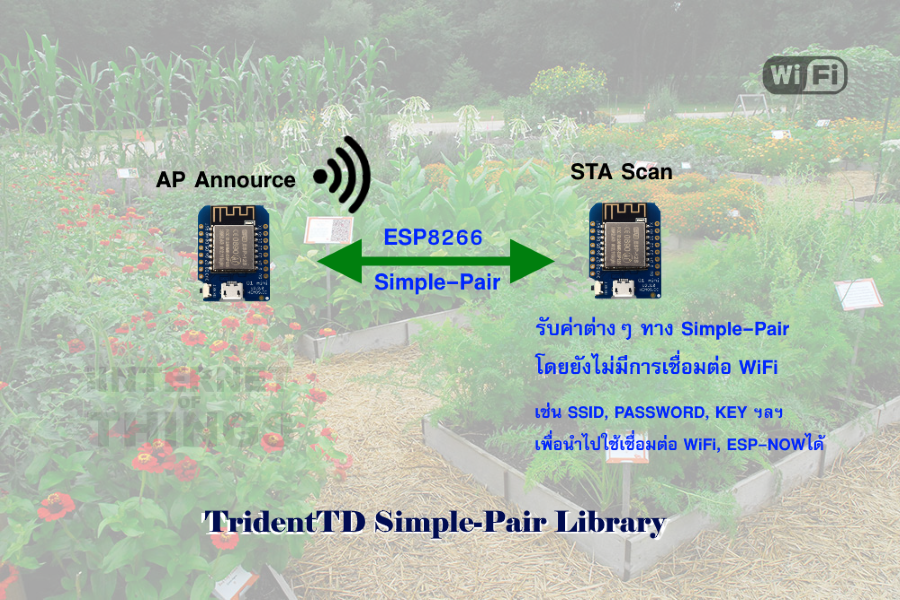

TridentTD_SimplePair
============
Esp8266  Simple-Pair Library
---------------------------------------------

TridentTD_SimplePair is a library for  
exchanging  WiFi SSID & Password   or ESP-NOW key
between ESP8266 modules by ESP Simple-Pair SDK API.

You can use functions like this

**AP Mode**

- SimplePair.mode(SP_AP);
- SimplePair.setSimplePairKey( key_for_simplepair_encrypt );
- SimplePair.setSimplePairData( data_for_exchange );
- SimplePair.setEspNowKey( key_for_using_in_ESP_NOW);
- SimplePair.annource();

**STATION Mode** 

- SimplePair.mode(SP_STA);
- SimplePair.setSimplePairKey( key_for_simplepair_encrypt );
- SimplePair.scanSP();
- SimplePair.getSimplePairData();

- SimplePair.getEspNowKey( key_for_using_in_ESP_NOW);

Example
---
Please look in example folder.

18 August 2560BE  (2017)
Ven. Phaisarn Techajaruwong
